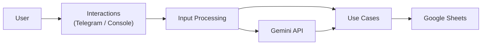

# MyFinanceTracker

[]()

Personal finance tracker built with Clean Architecture, CQRS, Google Sheets persistence, Telegram integration, and AI-powered command parsing.

## Features

- Clean Architecture + CQRS
- Google Gemini integration
- Natural language expense parsing
- Google Sheets persistence
- Telegram Bot support
- Console interaction mode
- YAML-based category configuration
- Structured logging

## Architecture



## Project Structure

```text
src/
├── MyFinanceTracker.Domain/
├── MyFinanceTracker.Common/
├── MyFinanceTracker.UseCases/
├── MyFinanceTracker.Infrastructure.Persistence/
├── MyFinanceTracker.InputProcessing.Text/
├── MyFinanceTracker.Interactions/
└── MyFinanceTracker.Host/
```

## Quick Start

### 1. Create your Google Sheets tracker

Create your own spreadsheet from the template:

https://docs.google.com/spreadsheets/d/19c9D0FdtEJCOoXVpclh6MyWBv0ZN7SgH5nojOpvZq9c/copy

### 2. Create a Google Service Account

1. Create a Google Cloud project.
2. Enable the Google Sheets API.
3. Create a Service Account.
4. Download the credentials JSON file.

Place the file next to the application:

```text
google-api-credentials.json
```

### 3. Share the spreadsheet

Share your copied spreadsheet with the Service Account email address and grant it **Editor** permissions.

### 4. Configure the application

Create `appsettings.Local.json`:

```json
{
  "GoogleSheets": {
    "SpreadsheetId": "YOUR_SPREADSHEET_ID"
  },
  "Gemini": {
    "ApiKey": "YOUR_GEMINI_API_KEY"
  }
}
```

### 5. Run the application

```bash
git clone https://github.com/YOUR_USERNAME/MyFinanceTracker.git
cd MyFinanceTracker

dotnet build
dotnet run --project src/MyFinanceTracker.Host
```

## Configuration

### Full Configuration Example

```json
{
  "GoogleSheets": {
    "SpreadsheetId": "YOUR_SPREADSHEET_ID",
    "CredentialsFilePath": "google-api-credentials.json",
    "HeaderRowsCount": 3,
    "ApplicationName": "MyFinanceTracker",
    "DecimalSeparator": ","
  },
  "YamlPersistence": {
    "FilePath": "categories.yaml"
  },
  "Telegram": {
    "Token": "YOUR_TELEGRAM_BOT_TOKEN",
    "AllowedUserId": 123456789
  },
  "Interactions": {
    "EnableConsole": true,
    "EnableTelegram": false
  },
  "Gemini": {
    "ApiKey": "YOUR_GEMINI_API_KEY",
    "Model": "gemini-3.5-flash",
    "Temperature": 0.1
  }
}
```

### Telegram Mode

To run the Telegram bot:

```json
{
  "Interactions": {
    "EnableConsole": false,
    "EnableTelegram": true
  }
}
```

Make sure that:

- `Telegram:Token` is configured.
- `Telegram:AllowedUserId` contains your Telegram user ID.

### Console Mode

To run as a console application:

```json
{
  "Interactions": {
    "EnableConsole": true,
    "EnableTelegram": false
  }
}
```

### Categories Configuration

```yaml
Categories:
  - Name: Food
    IsIncome: false
    Aliases:
      - groceries
      - supermarket
      - lunch

  - Name: Salary
    IsIncome: true
    Aliases:
      - paycheck
      - income
```

## Usage Examples

### Natural Language

```text
Spent 15.50 on groceries today
Spent 8.40 at a cafe
Received salary 2500
```

### Example Commands

```text
Spent 15.50 on groceries
Received 2500 salary
Spent 8.40 at Starbucks
```

## Contributing

Contributions, bug reports, and feature requests are welcome.