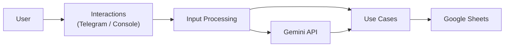

# MyFinanceTracker

[]()

Personal finance tracker that stores transactions in Google Sheets and supports natural language expense tracking through Console and Telegram interfaces.

## Features

- Natural language transaction parsing
- Google Sheets persistence
- Telegram Bot support
- Console interaction mode
- Google Gemini integration
- YAML-based category configuration
- Clean Architecture + CQRS
- Structured logging

## Architecture



## Project Structure

```text
src/
├── MyFinanceTracker.Domain/
├── MyFinanceTracker.Common/
├── MyFinanceTracker.UseCases/
├── MyFinanceTracker.Infrastructure.Persistence/
├── MyFinanceTracker.InputProcessing.Text/
├── MyFinanceTracker.Interactions/
└── MyFinanceTracker.Host/
```

## Quick Start

### 1. Create your Google Sheets tracker

Create your own spreadsheet from the template:

https://docs.google.com/spreadsheets/d/19c9D0FdtEJCOoXVpclh6MyWBv0ZN7SgH5nojOpvZq9c/copy

### 2. Create a Google Service Account

1. Create a Google Cloud project.
2. Enable the Google Sheets API.
3. Create a Service Account.
4. Download the credentials JSON file.

Place the credentials file next to the application binaries:

```text
google-api-credentials.json
```

### 3. Share the spreadsheet

Share your copied spreadsheet with the Service Account email address and grant it **Editor** permissions.

### 4. Configure the application

Create `appsettings.Local.json`:

```json
{
  "GoogleSheets": {
    "SpreadsheetId": "YOUR_SPREADSHEET_ID"
  },
  "Gemini": {
    "ApiKey": "YOUR_GEMINI_API_KEY"
  }
}
```

### 5. Run the application

```bash
git clone https://github.com/<YOUR_GITHUB_USERNAME>/MyFinanceTracker.git
cd MyFinanceTracker

dotnet build
dotnet run --project src/MyFinanceTracker.Host
```

## Configuration

### Full Configuration Example

```json
{
  "GoogleSheets": {
    "SpreadsheetId": "YOUR_SPREADSHEET_ID",
    "CredentialsFilePath": "google-api-credentials.json",
    "HeaderRowsCount": 3,
    "ApplicationName": "MyFinanceTracker",
    "DecimalSeparator": ","
  },
  "YamlPersistence": {
    "FilePath": "categories.yaml"
  },
  "Telegram": {
    "Token": "YOUR_TELEGRAM_BOT_TOKEN",
    "AllowedUserId": 123456789
  },
  "Interactions": {
    "EnableConsole": true,
    "EnableTelegram": false
  },
  "Gemini": {
    "ApiKey": "YOUR_GEMINI_API_KEY",
    "Model": "gemini-3.5-flash",
    "Temperature": 0.1
  }
}
```

### Telegram Mode

```json
{
  "Interactions": {
    "EnableConsole": false,
    "EnableTelegram": true
  }
}
```

Make sure that:

- `Telegram:Token` is configured.
- `Telegram:AllowedUserId` contains your Telegram user ID.

### Console Mode

```json
{
  "Interactions": {
    "EnableConsole": true,
    "EnableTelegram": false
  }
}
```

## Categories Configuration

Create a `categories.yaml` file next to the application binaries.

```text
MyFinanceTracker.Host/
├── appsettings.json
├── appsettings.Local.json
├── categories.yaml
├── google-api-credentials.json
└── MyFinanceTracker.Host.exe
```

The category IDs are designed to work with the provided Google Sheets template:

https://docs.google.com/spreadsheets/d/19c9D0FdtEJCOoXVpclh6MyWBv0ZN7SgH5nojOpvZq9c/copy

### Example categories.yaml

```yaml
categories:
  - id: "B"
    name: "Income"
    isIncome: true
    aliases:
      - income
      - salary
      - paycheck

  - id: "C"
    name: "Food"
    isIncome: false
    aliases:
      - food
      - grocery
      - supermarket

  - id: "N"
    name: "Restaurants"
    isIncome: false
    aliases:
      - restaurant
      - cafe
      - fastfood

  - id: "AL"
    name: "Other"
    isIncome: false
    aliases:
      - other
      - misc
```

> **Important**
>
> Category IDs must match the column IDs used by the Google Sheets template.
> Transactions are written to spreadsheet columns based on the category `id`.

> **Important**
>
> At least one income category must contain the alias `income`.
> This alias is used as the default income category by the application.

## Usage Examples

```text
Spent 15.50 on groceries
Spent 8.40 at Starbucks
Received salary 2500
```