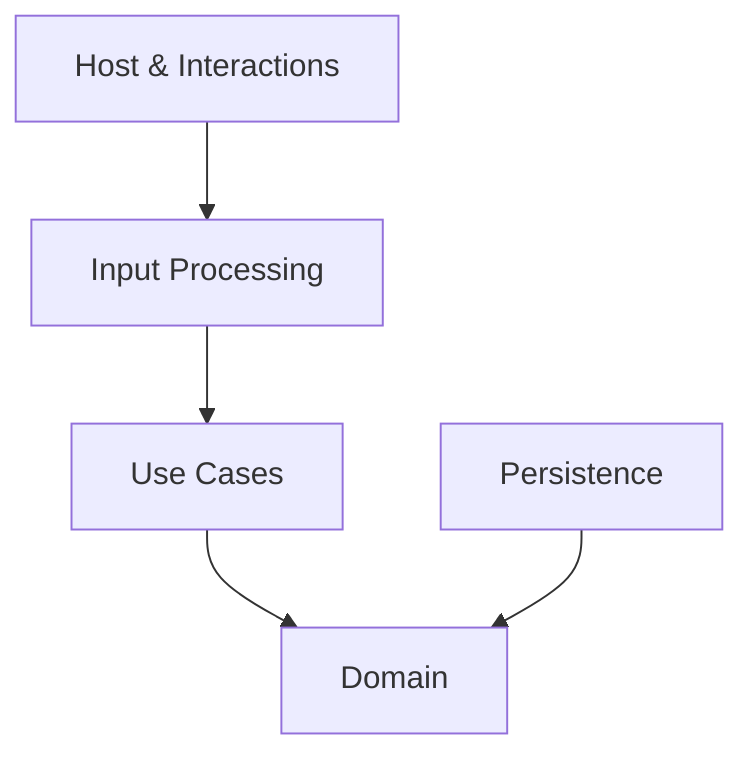

# MyFinanceTracker

[]()
[]()

Personal finance tracker built with Clean Architecture, CQRS, Google Sheets persistence, and AI-powered command parsing.

## Features

- Clean Architecture + CQRS
- Google Gemini integration
- Structured-based command parser
- Google Sheets persistence
- Telegram Bot support
- Structured logging
- YAML-based category configuration

## Architecture



## Project Structure

```text
src/
├── MyFinanceTracker.Domain/
├── MyFinanceTracker.Common/
├── MyFinanceTracker.UseCases/
├── MyFinanceTracker.Infrastructure.Persistence/
├── MyFinanceTracker.InputProcessing.Text/
├── MyFinanceTracker.Interactions/
└── MyFinanceTracker.Host/
```


## Quick Start

1. Create your own Google Sheets tracker from the template:

   https://docs.google.com/spreadsheets/d/19c9D0FdtEJCOoXVpclh6MyWBv0ZN7SgH5nojOpvZq9c/copy

2. Open the copied spreadsheet and note its ID from the URL.

3. Configure the `SpreadsheetId` value in `appsettings.Local.json`.

4. Create a Google Service Account and grant it access to your copied spreadsheet.

5. Run the application and start tracking your expenses.


## Configuration

### appsettings.Local.json

```json
{
  "Gemini": {
    "ApiKey": "YOUR_GEMINI_API_KEY"
  },
  "GoogleSheets": {
    "SpreadsheetId": "YOUR_SPREADSHEET_ID",
    "CredentialsFilePath": "google-credentials.json"
  },
  "Telegram": {
    "BotToken": "YOUR_TELEGRAM_BOT_TOKEN"
  }
}
```

### categories.yaml

```yaml
Categories:
  - Name: Food
    IsIncome: false
    Aliases:
      - groceries
      - supermarket
      - lunch

  - Name: Salary
    IsIncome: true
    Aliases:
      - paycheck
      - income
```

## Running

```bash
git clone https://github.com/your-username/MyFinanceTracker.git
cd MyFinanceTracker

dotnet build
dotnet run --project src/MyFinanceTracker.Host
```

## Examples

### Natural Language

```text
Spent 15.50 on groceries today at Walmart
```

### Structured Commands

```bash
t add expense Food 15.50 "Walmart"
t rem Food 03.02.2026
```