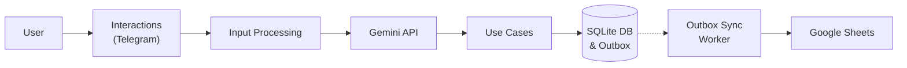

# MyFinanceTracker

[](https://github.com/Linnod/MyFinanceTracker/actions/workflows/ci-cd.yml)
[]()

Personal finance tracker that stores transactions in Google Sheets and supports multimodal expense tracking (text, voice, receipt photos, and banking screenshots) through Telegram bot interface.

## Features

- Complete natural language transaction lifecycle: create, list/filter, update, and delete
- Multimodal transaction input: text commands, voice messages, receipt photos, and banking screenshots
- Gemini-powered natural language processing, audio transcription, and image analysis
- Local SQLite persistence with Transactional Outbox pattern
- Resilient background synchronization to Google Sheets (retry policy & dead-letter queue)
- Category management synchronized with Google Sheets and SQLite
- Telegram Bot interaction mode
- Clean Architecture + CQRS (MediatR)
- Structured logging with correlation IDs

## Architecture


```mermaid
flowchart LR
    User["User"]

    Interactions["Interactions
    (Telegram)"]

    Parser["Input Processing"]

    Gemini["Gemini API"]

    UseCases["Use Cases"]

    Sqlite[("SQLite DB
    & Outbox")]

    Sync["Outbox Sync
    Worker"]

    Sheets["Google Sheets"]

    User --> Interactions
    Interactions --> Parser

    Parser --> Gemini

    Gemini --> UseCases

    UseCases --> Sqlite
    Sqlite -.-> Sync
    Sync --> Sheets
```

## Project Structure

```text
src/
├── MyFinanceTracker.Domain/
├── MyFinanceTracker.Common/
├── MyFinanceTracker.UseCases/
├── MyFinanceTracker.Infrastructure.Persistence.GoogleSheets/
├── MyFinanceTracker.Infrastructure.Persistence.Sqlite/
├── MyFinanceTracker.InputProcessing/
├── MyFinanceTracker.InputProcessing.Gemini/
├── MyFinanceTracker.Interactions.Telegram/
└── MyFinanceTracker.Host/

tests/
├── MyFinanceTracker.Domain.Tests/
├── MyFinanceTracker.UseCases.Tests/
├── MyFinanceTracker.Infrastructure.Persistence.GoogleSheets.Tests/
├── MyFinanceTracker.Infrastructure.Persistence.Sqlite.Tests/
├── MyFinanceTracker.InputProcessing.Gemini.Tests/
└── MyFinanceTracker.Interactions.Telegram.Tests/
```

## Quick Start

### 1. Clone the repository

```bash
git clone https://github.com/Linnod/MyFinanceTracker.git
cd MyFinanceTracker
```

### 2. Create your Google Sheets tracker

Create your own spreadsheet from the template:

https://docs.google.com/spreadsheets/d/19c9D0FdtEJCOoXVpclh6MyWBv0ZN7SgH5nojOpvZq9c/copy

The spreadsheet uses a flat `Transactions` table schema with columns: `Id`, `Date`, `Type`, `Category`, `Amount`, `Note`.

### 3. Create a Google Service Account

1. Create a Google Cloud project.
2. Enable the Google Sheets API.
3. Create a Service Account.
4. Download the credentials JSON file and save it as `google-api-credentials.json` in the repository root.

### 4. Share the spreadsheet

Share your copied spreadsheet with the Service Account email address and grant it **Editor** permissions.

### 5. Configure categories

Categories are stored on the `Categories` sheet in your Google Spreadsheet (with columns: `Id`, `Name`, `IsArchived`). On first startup with an empty local SQLite database, existing categories and transactions are imported from Google Sheets; once the local database is populated, subsequent startups skip remote import and sync local changes to Google Sheets via the outbox.

### 6. Configure the application

Create `appsettings.Development.json` in the repository root:

```json
{
  "GoogleSheets": {
    "SpreadsheetId": "YOUR_SPREADSHEET_ID"
  },
  "Gemini": {
    "ApiKey": "YOUR_GEMINI_API_KEY",
    "Model": "YOUR_GEMINI_MODEL"
  }
}
```

### 7. Run the application

```bash
dotnet build
dotnet run --project src/MyFinanceTracker.Host
```

## Configuration

### Full Configuration Example

```json
{
  "GoogleSheets": {
    "SpreadsheetId": "YOUR_SPREADSHEET_ID",
    "CredentialsFilePath": "google-api-credentials.json",
    "TransactionsSheetName": "Transactions",
    "CategoriesSheetName": "Categories",
    "ApplicationName": "MyFinanceTracker",
    "DecimalSeparator": ","
  },
  "SqlitePersistence": {
    "ConnectionString": "Data Source=finance.db",
    "SyncIntervalSeconds": 60,
    "MaxRetryAttempts": 5
  },
  "Telegram": {
    "Token": "YOUR_TELEGRAM_BOT_TOKEN",
    "AllowedUserId": 123456789
  },
  "Gemini": {
    "ApiKey": "YOUR_GEMINI_API_KEY",
    "Model": "YOUR_GEMINI_MODEL"
  }
}
```

### Category Configuration Notes

> [!IMPORTANT]
> Category `id` is a unique identifier (slug) recorded on the `Transactions` sheet in Google Sheets, while `name` is used as the display name for Telegram messages and Gemini prompts.

### Telegram Settings

Make sure that:

- `Telegram:Token` is configured.
- `Telegram:AllowedUserId` contains your Telegram user ID.

## Docker Deployment

You can also run the application as a background service via Docker Compose:

1. Prepare configuration files, persistent data directory, and secrets:
   ```bash
   cp .env.example .env
   cp google-api-credentials.json deploy/google-api-credentials.json
   mkdir -p deploy/data
   ```

2. Fill in `.env` with your Telegram, Google Sheets, and Gemini credentials.

3. Start the container:
   ```bash
   docker compose up -d
   ```

> [!NOTE]
> The SQLite database and outbox queue are stored in `deploy/data/finance.db` via a mounted Docker volume, ensuring transaction data and sync state persist across container updates and restarts.

## Usage Examples

### Text Commands

Natural language input in any language for adding, viewing, updating, and deleting transactions:

```text
# Add transactions
Spent 15.50 on groceries
Spent 8.40 at Starbucks yesterday
Received salary 2500

# View transactions
Show transactions for yesterday
View food expenses for last week
Show October transactions

# Update a transaction (by ID)
Update transaction 7d9a8c12-34ef-5678-90ab-cdef12345678: 18.50 cafe
Change transaction 7d9a8c12-34ef-5678-90ab-cdef12345678: remove note

# Delete transactions (by ID)
Delete transaction 7d9a8c12-34ef-5678-90ab-cdef12345678
Delete transactions 7d9a8c12-34ef-5678-90ab-cdef12345678 and 1a2b3c4d-5678-90ab-cdef-1234567890ab
```

### Voice Messages (Telegram)

Send voice messages directly to the Telegram bot in any language:

> *"Spent 12 euros on lunch at Subway"*  
> *"Bought coffee and a croissant for 7.50"*

### Receipts & Screenshots (Telegram)

Send images directly to the bot:

- **Receipts**: Automatically extracts the total amount, infers the category from the merchant/items, and extracts the transaction date.
- **Banking App Screenshots**: Recognizes transaction details from apps such as Revolut, Monzo, etc.
- **Optional Captions**: Attach a text caption to clarify or override details (e.g. `Pharmacy yesterday` or `Groceries split with friend`).
